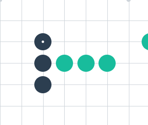
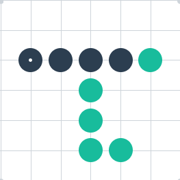

# Defunition de la fonction d'evaluation

## Situations perdantes

- 3 pions de l'adversaire de suite qui ne sont bloques d'aucun cote.

  

- 4 pions de l'adversaire qui sont bloques de 1 cote ou moins + trous.

  

chemin bloqué = 0  
1 pion seul = 1 point  
2 ensembles + 1 coté bloqué = 2 points  
2 ensembles libres = 3 points  
3 ensembles + 1 coté bloqué = 4 points  
3 ensembles libres = 5 points  
4 ensembles + 1 coté bloqué = 6 points  
4 ensembles libres = inf

ArrayList tableau du board

Algo:

move(){

verifier score actuel  
si on est d=0  
make move

move(nouvelles données, d-1)

return x, y  
}
